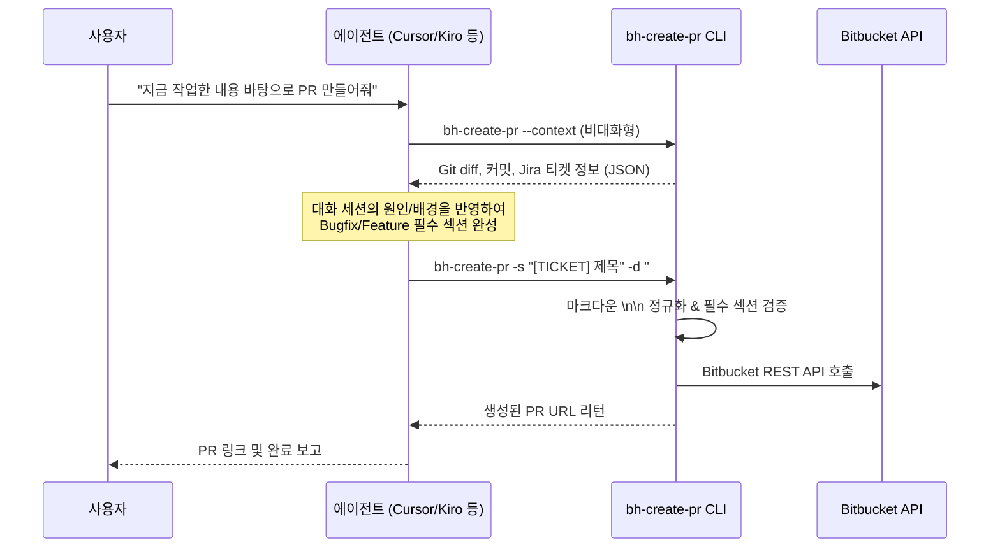

# 에이전트 호환성 및 다중 에이전트 연동 가이드

`bh-agent-kit`은 여러 AI 코딩 에이전트(Cursor, Kiro CLI, Antigravity, Claude Code, Codex 등)가 일관된 룰과 도구를 공유할 수 있도록 설계된 **Single Source of Truth(SSOT)**입니다.

이 문서는 각 에이전트 플랫폼별 규칙 로딩 방식, 프론트매터 규격, 도구 호출 규칙, 동기화 방법을 정의합니다.

---

## 1. 에이전트별 호환성 매트릭스

| 플랫폼 | 규칙(Rules) 로드 경로 | 프론트매터 규격 | 도구 실행 도구 | 비고 |
| :--- | :--- | :--- | :--- | :--- |
| **Cursor IDE** | `~/.cursor/rules/*.mdc` | `alwaysApply: bool`<br>`description: str`<br>`globs: str` | Bash Terminal Tool | `rules/*.md` + `rules-meta.json`을 조합하여 `.mdc`로 자동 변환 |
| **Kiro CLI** | `~/.kiro/steering/*.md` | `inclusion: always \| manual \| fileMatch` | Bash Tool | `rules/*.md`를 심볼릭 링크로 직접 참조 |
| **Antigravity** | `~/.gemini/config/rules/*.md` | 마크다운 본문 / 메타데이터 | `run_command` | 로컬 `~/.agents` 허브와 연동 |
| **Claude Code** | `CLAUDE.md` / `~/.claude/` | 마크다운 헤더 / 시스템 프롬프트 | Bash Tool | `sync-to-agents.sh` 파이프라인으로 동기화 |
| **Codex** | `AGENTS.md` / `~/.codex/` | 마크다운 헤더 기반 | Bash Tool | 파일명 순서 기반 로드 (`00-inquiry-first.md` 최상단) |

---

## 2. 규칙(Rules) Frontmatter 매핑 규격

에이전트마다 룰의 활성화 조건(상시 적용 vs 온디맨드 로드)을 해석하는 방식이 다릅니다:

### ① Cursor 형식 (`rules-meta.json` ➔ `.mdc`)
Cursor는 상단 YAML Frontmatter를 기반으로 동작합니다:
```yaml
---
description: Bitbucket PR 생성 및 설명 작성 시 bh-create-pr CLI 사용 지침
alwaysApply: false
---
```
- `alwaysApply: true`: 모든 프롬프트 세션에 상시 컨텍스트 주입 (예: `00-inquiry-first`, `communication-style`)
- `alwaysApply: false`: 시맨틱 인덱싱을 통해 사용자의 의도나 파일 패턴에 맞을 때만 동적 주입 (예: `bh-create-pr`, `bh-ticket-maker`)

### ② Kiro CLI 형식 (`~/.kiro/steering/`)
Kiro는 `inclusion` 키를 기준으로 룰을 제어합니다:
```yaml
---
inclusion: manual
description: Jira 티켓 생성 시 bh-ticket-maker 사용
---
```
- `inclusion: always` 또는 프론트매터 없음: 모든 세션에 상시 로드
- `inclusion: manual`: 사용자가 세션 내에서 명시적으로 요구하거나 관련 프롬프트가 실행될 때만 로드
- `inclusion: fileMatch`: 특정 파일 glob 패턴 일치 시 로드

---

## 3. `bh-*` 로컬 CLI 도구 에이전트 연동 원칙

`bh-agent-kit`에 포함된 CLI 도구([`bh-create-pr`](../scripts/bh-create-pr.md), [`bh-ticket-maker`](../scripts/bh-ticket-maker.md) 등)를 에이전트가 호출할 때는 아래 3대 불변식을 준수해야 합니다.

### ① 비대화형(Non-blocking) 실행 강제
에이전트가 터미널 도구를 실행할 때 대화형 입력 프롬프트가 뜨면 세션이 멈추거나 타임아웃이 발생할 수 있습니다.
따라서 **모든 에이전트는 비대화형 플래그를 조합하여 호출**해야 합니다:
- **`bh-create-pr`**: `-s <제목>`, `-d <본문>`, `-c`(생성), `-y`(확인 건너뛰기) 사용
- **`bh-ticket-maker`**: `-s <제목>`, `-d <본문>`, `-p <프로젝트>`, `-t <유형>`, `-y`(확인 건너뛰기) 사용

### ② 하이브리드(Hybrid) 연동 워크플로우
에이전트의 강점인 "대화 맥락 이해도"와 CLI의 강점인 "정형화된 검증 및 API 연동"을 결합합니다:



### ③ Bugfix 필수 3섹션 강제 검증
에이전트가 버그 수정을 완료하고 PR을 생성할 때 아래 항목을 빠뜨리면 CLI 수준에서 경고 또는 차단(`--strict`)됩니다:
1. `## 이슈현상*`: 어떤 조건에서 어떤 오류가 발생했는지
2. `## 발생 원인*`: 코드 diff 기반의 근본 원인(Root Cause)
3. `## 해결방법*`: 무엇을 어떻게 수정했고 왜 그렇게 했는지

---

## 4. 로컬 환경 동기화 및 배포 절차

새로운 규칙이나 스크립트를 추가/수정한 후 각 에이전트에 반영하는 표준 절차입니다.

### ① Kiro CLI 동기화 (심볼릭 링크)
`~/.kiro/steering/` 디렉터리에 `bh-agent-kit/rules/*.md` 파일을 심볼릭 링크로 연결합니다:
```bash
mkdir -p ~/.kiro/steering
for f in ~/bh-agent-kit/rules/*.md; do
  ln -sf "$f" ~/.kiro/steering/$(basename "$f")
done
```

### ② Cursor 및 로컬 에이전트 허브 동기화
`~/.agents` 허브를 거쳐 Cursor `.mdc` 파일로 변환 배포합니다:
```bash
# 1. 룰 및 메타데이터 복사
cp rules/*.md ~/.agents/rules/
# (필요 시 ~/.agents/rules-meta.json 병합)

# 2. 전체 동기화 스크립트 실행 (Cursor .mdc 자동 생성)
bash ~/.agents/scripts/sync-to-agents.sh --full
```

### ③ $PATH 실행 권한 확인
에이전트가 서브쉘에서 도구를 바로 찾을 수 있도록 실행 바이너리 디렉터리가 `$PATH`에 포함되어 있어야 합니다:
```bash
which bh-create-pr      # ~/bin/bh-create-pr
which bh-ticket-maker   # ~/bin/bh-ticket-maker
```
